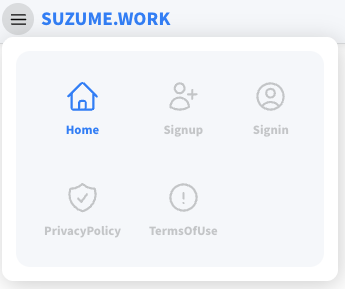
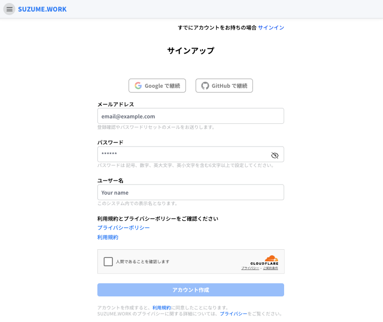
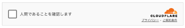
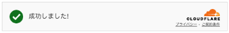
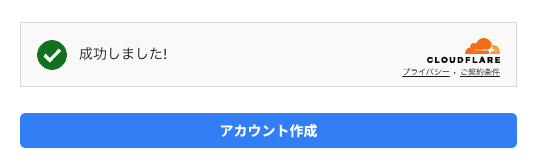
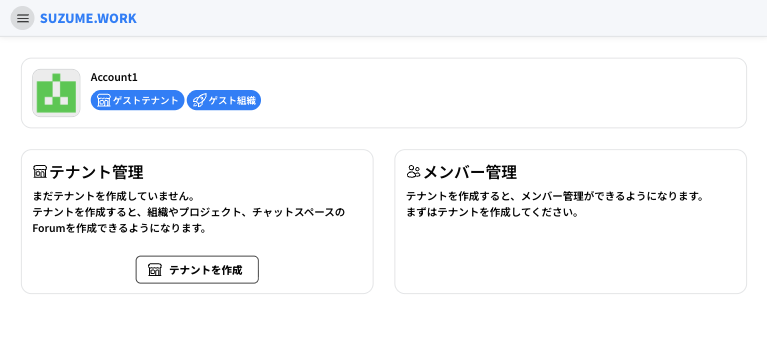

# 会員登録

検索タグ： `会員登録` `サインアップ` `ユーザー登録`

## 1. メニューを開く

左上の３本線ボタンをクリックしてメニューを開きます

## 2. 会員登録画面へ移動

新規会員登録の場合は **Signup** を押下して会員登録画面へと移動します

## 3. プライバシーポリシーと利用規約への同意

**プライバシーポリシー** 、 **利用規約** をご確認下さい

**アカウント作成を行いますと、これらに同意したことになります**

## 4. セキュリティ認証

Cloudflare の Turnstile のチェックボックスが表示されていたら、チェックしてください

## 5. アカウント作成

**アカウント作成** ボタンを押下してアカウントを作成します

## 6. メール認証

**登録に使用したメールアドレス** 宛に下記のメールが届きます

> 迷惑メールに届く場合があります

**登録確認** ボタンを押下して登録を完了しておいてください。

## 7. アカウント登録完了

アカウント作成が完了すると、自動でログインしダッシュボードが表示されます

## 8. テナント作成

次は、左のサイドバーから「[テナント作成](page/01_tenant.md)」をご覧ください。
