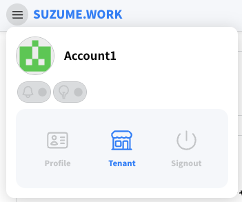
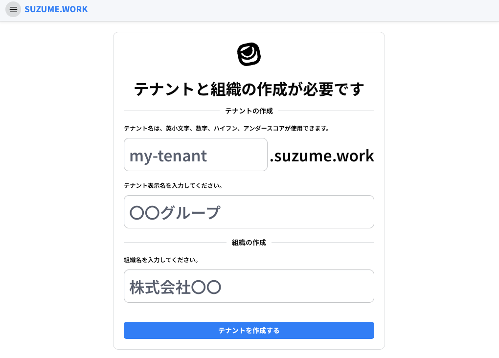
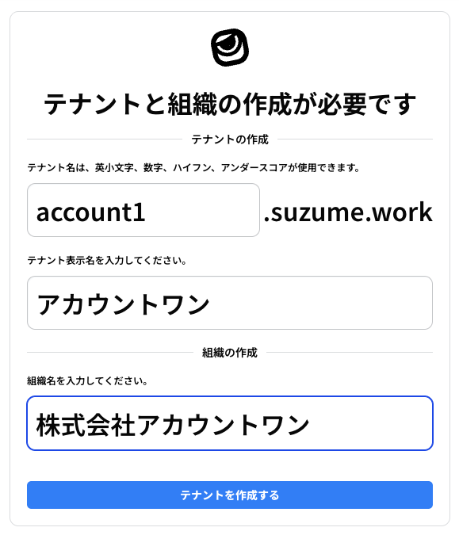
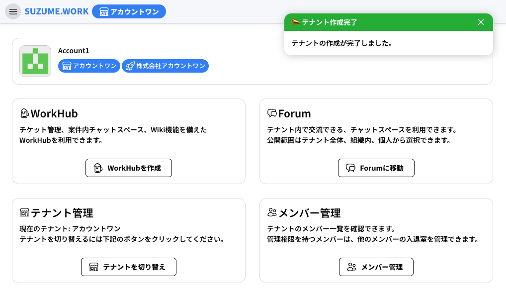

# テナント作成

## テナントと組織について

テナントと組織を作成して、 `WorkHub` や `Forum`、 `Members` の利用を開始しましょう。

`WorkHub` と `Forum` は 同じテナント内のメンバーに表示される機能です。

また、 組織のメンバーは他のテナントから招待を受け、他のテナントへ参加することができます。

このとき、所属組織はそのまま利用することができます。

### 1. テナントと組織の作成

メニューから 「Tenant」を選択します

### 2. テナントと組織の作成画面

- `my-tenant` と表示されているフォームには英数小文字、ハイフン、アンダースコア（`_`）が利用できます。
- `〇〇グループ` と表示されているフォームにはテナント名を入力してください。
    - このテナント名は ほか箇所でも利用されるため、わかりやすいテナント名を入力してください（例: エスクルー）
- `株式会社〇〇` と表示されているフォームには組織名を入力してください。
    - 基本的には会社名や団体名を入力していただければ大丈夫です

### 3. テナントと組織の作成完了

**テナントを作成する** ボタンを押下するとテナントと組織の作成が完了します。

### 4. 組織メンバーの招待

次は、左のサイドバーから「[組織メンバーの招待](page/02_organization.md)」をご覧ください。
