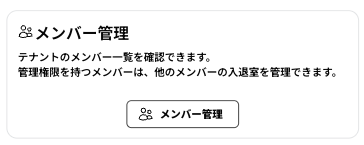
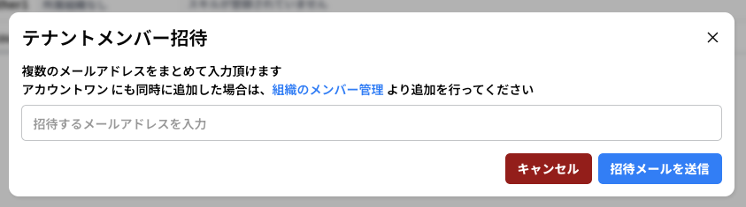
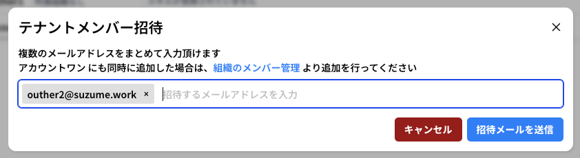
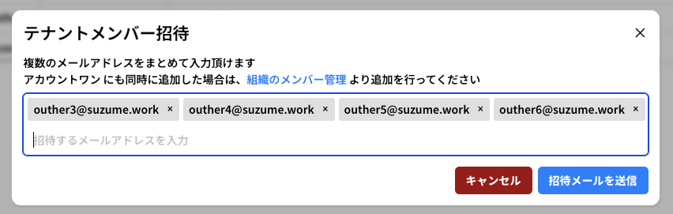
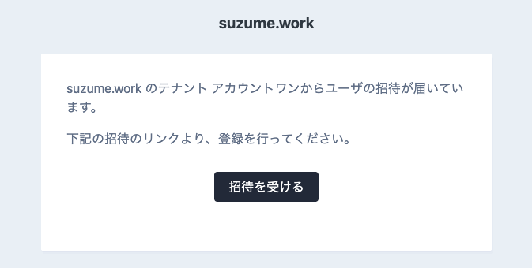
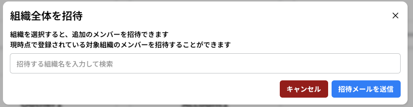
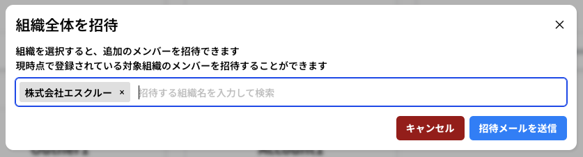

# テナントにメンバーを招待する

テナントにメンバーを追加する方法は幾つかあります。

1. **組織のメンバー管理から招待する**
   - 組織のメンバー管理から招待すると、 **テナント、組織の両方に追加** されます
   - 招待リンクを共有する方法と、CSVによる一括登録の2種類の方法で招待できます
2. **テナントのメンバー管理から招待する**
   - テナントのメンバー管理から招待すると、 **テナントのみに追加** します
   - メールアドレスによる招待の送信のほか、組織単位の一括登録の２種類の方法で招待できます
3. **WorkHub の作業メンバーとして外部メンバーを招待する**
   - WorkHub の作業メンバーとして外部メンバーを招待すると、 **テナント、WorkHubの作業メンバーの両方に追加** されます
   - テナント内メンバーをWorkメンバーとして招待できる他、招待URLを外部メンバーに共有する２種類の方法で招待できます

## 1. 組織メンバーの招待

詳細は「[組織メンバーの招待](page/02_organization.md)」をご覧ください。

## 2. テナントメンバーの招待

テナントメンバー管理からの招待では、 **組織には追加せずにテナントのメンバーとして追加** します

すでに他の組織のメンバーだったり、外部ユーザーをテナント内の情報にアクセスできるようにするときにご利用ください

### テナントのメンバー管理を開く

メニューから 「Members」を押下するか、ダッシュボードの「メンバー管理」 ボタンを押下します




この画面では、表示方法の切り替えなどができます。

詳しくは「Tenant / メンバー機能（Members）」をご確認ください。

### メールアドレスを利用してテナントに招待する

招待したいユーザーのメールアドレスを利用してユーザーを招待します。

画面上部の  ボタンを押下して入力フォームを表示してください。



このフォームにはメールアドレスを複数入力することができます

例として `outher2@suzume.work` を入力し、最後に **半角スペース** を入力すると以下のようになります



また、以下のように改行区切り、カンマ区切りのテキストをコピーして貼付けすることもできます

```
outher3@suzume.work,outher4@suzume.work
outher5@suzume.work
outher6@suzume.work
```



「招待メールを送信」ボタンを押下すると招待メールを送信できます。


招待メールからは「会員登録」と同じ流れで登録ができます。



### 他の組織のすべてのユーザーを招待する

テナントに他の組織全体を追加する事ができます。

画面上部の  ボタンを押下して入力フォームを表示してください。



組織名を入力して選択します



「招待メールを送信」ボタンを押下すると **招待メールを組織のメンバー全員** に送信できます。


メールを受信して、ログインし、下記画面の「招待を受け入れる」を押下すると、登録が完了します


