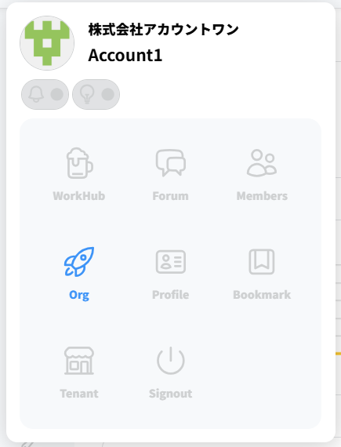
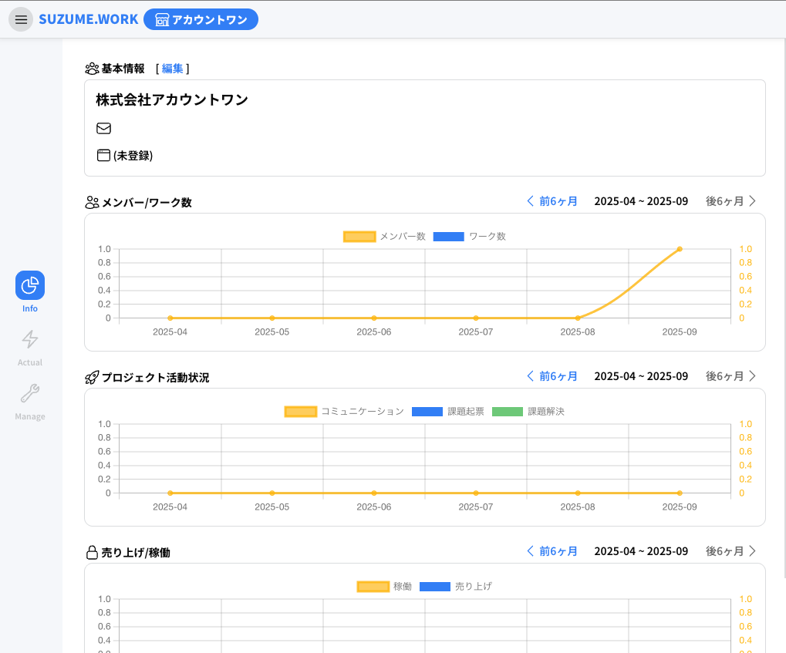

# 組織メンバーの招待

組織メンバーの招待では、個別の登録、CSV登録の２種類の方法が存在します。

## 1. 組織画面へ移動

まずメニューから「Org」を選択して組織画面へ移動します。



下記の画面に遷移します。



## 2. 管理画面へ移動

サイドバーの「Manage」を押下して管理画面へ移動します


### 招待コードについて

招待コードでは個別にアカウントを作成して組織とテナントへ招待することができます。

下記のような情報を取得できます。

```
招待リンク: https://app.suzume.work/backoffice/invitation/97c0c9b689aad6426ed3692ec4e461e2
招待コード: 1b870b61
```

### 招待コードを利用した登録の手順

このURLにアクセスすると招待コードの入力画面が表示されます


ここに招待コードをコピー＆ペーストします


コード認証ボタンを押下すると、会員登録（またはサインイン）の画面に遷移します。


新規登録と同じ流れで入力を行ってください。


「アカウント作成」を押下すると追加したユーザーがテナントと組織に追加されます。

テナントに参加している場合、ログイン時には下記のようにテナント選択画面が表示されます。


テナントを選択すると、ダッシュボードへ遷移できます。


これで、招待コードを利用したユーザー追加が完了しました

### CSVアップロードによる一括追加の手順

個別の招待による登録のほかに、CSVにて一括登録する方法があります

管理画面の「ユーザー管理」ボタンを押下します


すると、組織メンバーの一覧画面が表示できます


「csvダウンロード」ボタンを押下すると下記の確認ダイアログが表示されます


「OK」を押下し、ダウンロードすると以下のようなCSVを取得できます

```csv
id,user_code,name,initial_name,email,role,joined_at,leaved_at,memo
40,,Account1,,account@suzume.work,owner,,,
43,,Account2,,account2@suzume.work,member,,,
```

[CSVの各列について](#CSVの各列について) の内容を参照していただき、CSVファイルを作成ください。

作成したCSVファイルを「CSVアップロード」でアップロードすると下記の画面になります。


「アップロード」ボタンを押下するとCSVで追加したユーザーが追加されます。


登録したメールアドレス宛に下記のようなメールが届きます。


併記されているパスワードを利用してすぐにログインが可能です。


これで、CSVによる一括登録が完了します。

#### CSVの各列について

|id|user_code|name|initial_name|email|role|joined_at|leaved_at|memo|
|---|---|---|---|---|---|---|---|---|
|（省略可）ユーザーID<br>新規登録の場合は<br>省略してください|（省略可）社員コード<br>一覧のソートなどに<br>利用する文字列です。<br>(例： Y123456)|（必須）氏名|（省略可）イニシャル<br>（例： Y.T）|（必須）メールアドレス|（必須）権限<br>owner, admin <br>または　member|（省略可）入社日<br>（YYYY-MM-DD形式）|（省略可）退職日<br>（YYYY-MM-DD形式、<br>退職済みの場合のみ）|（省略可）メモ|
