# WorkHub について

**WorkHub** はチケット管理、チャットスペース、Wiki などの機能があります。

それぞれ、 Work に参加しているユーザーのみがアクセス可能になっています。

利用を開始するには Work を追加し、メンバーをアサインする必要があります。

## WorkHub に Work を追加する

まず、WorkHub に移動します。

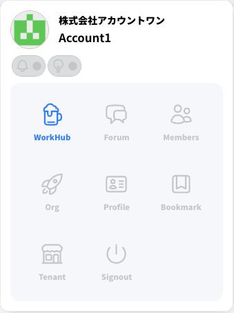

サイドメニューの 「Add Work」を押下します

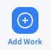

Work の追加ダイアログが表示されます。

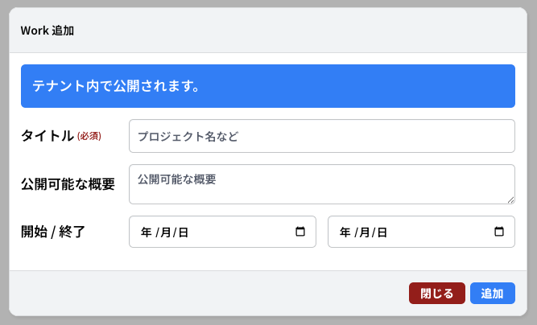

- **タイトル**
  - 入力必須
  - WorkHub 内での表示で利用します
- **公開可能な概要**
  - 任意ですが、入力推奨
  - WorkHub のほか、参加するメンバーの職歴に記載される内容です
  - 外部へも公開可能な範囲の内容を記載してください
- **開始 / 終了**
  - プロジェクト開始の年月日は必須入力です
  - プロジェクト終了の年月日は任意となっています

以下のように入力します

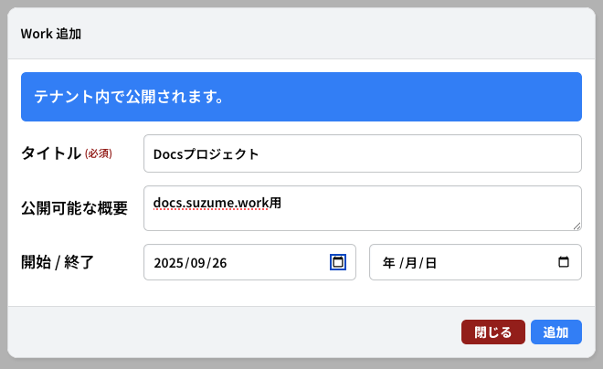

「追加」ボタンを押下すると Work の追加が完了します

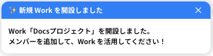

Work の TOP ページに自動で遷移します

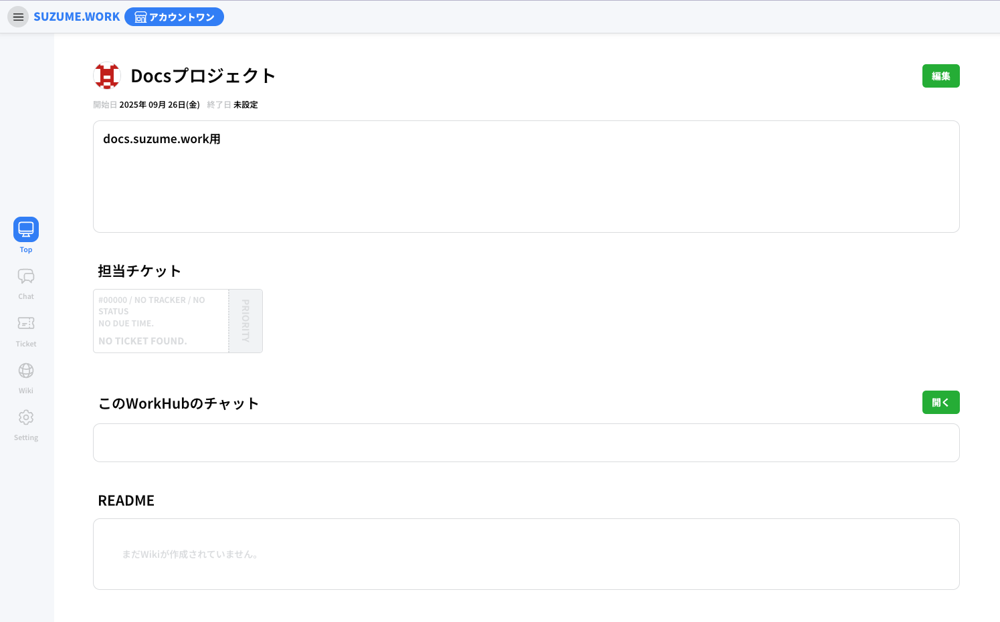

## Work にメンバーを追加する

Work を複数人で利用するには Work メンバーを追加する必要があります。

Work の TOP ページのサイドメニューから「Settings」を押下します

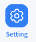

設定・管理ページが表示されるので「ユーザー管理」を押下します

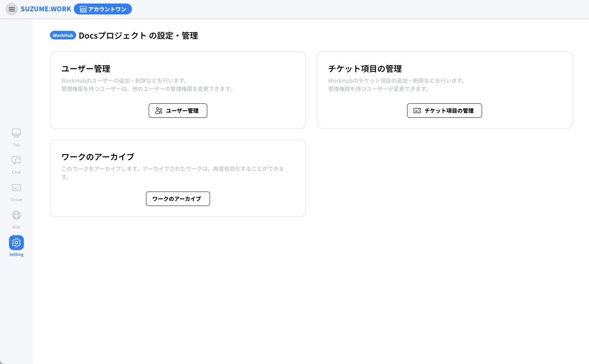

このワークに登録しているユーザーの一覧が表示されます

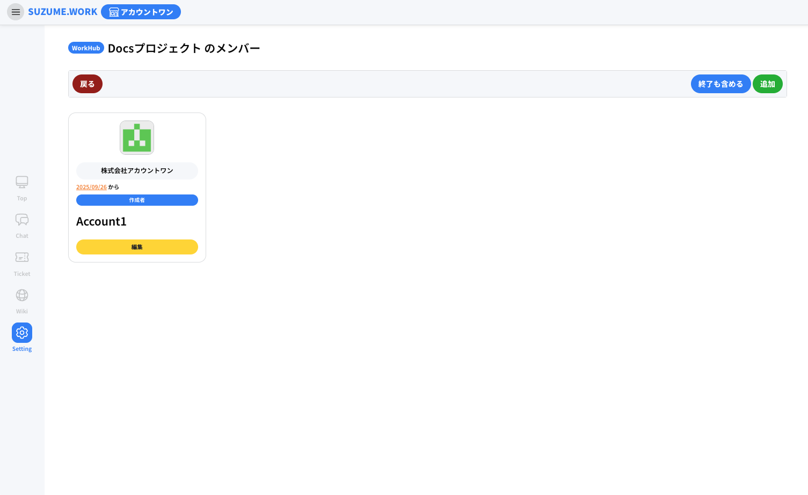

「追加」ボタンを押下すると「メンバー追加ダイアログ」が表示されます

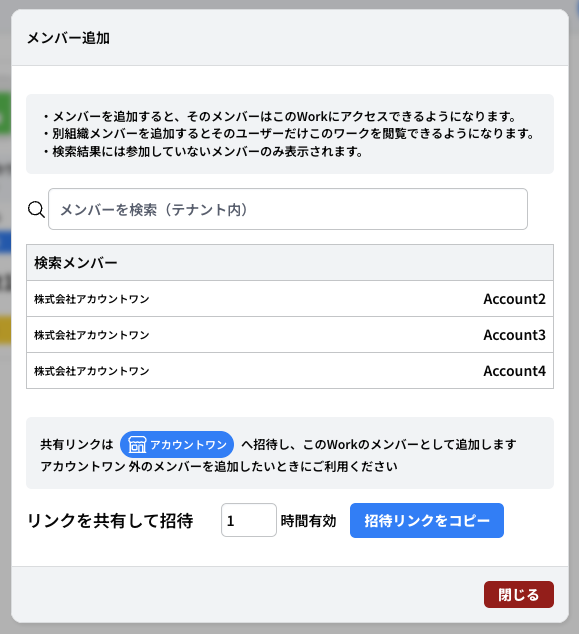

- 「メンバーを検索（テナント内）」の入力フォーム
  - この Work が存在するテナントに参加しているメンバーを名前で検索できます
  - テナントに未参加のユーザーは検索されません
- 「検索メンバー」のリスト
  - 検索結果を表示します
- **テナントへの招待権限がある場合は「共有リンク」の項目が表示されます**
  - テナントへの招待権限は現時点ではテナント作成者のみもっています
  - リンクの有効時間を設定し、招待リンクを押下すると、テナントとこのワークへの招待リンクをクロップボードへコピーできます
  - メールなどで招待を行いたいメンバーへ展開してください
  - このリンクは対象者を限定しない共有リンクのため取り扱いにはご注意ください

## チャットスペース

Workhub 内のチャットスペースでは Work に所属しているメンバー間でその Work 内の連絡や会議などに使用できます。

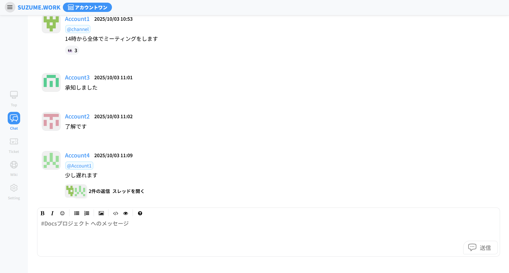

チャットに送信されたメッセージにカーソルを合わせると様々な操作ができます。

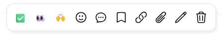

- ✅・・・チェック（スタンプ）
- 👀・・・既読確認（スタンプ）
- 🙌・・・リアクション（スタンプ）
- 🙂・・・絵文字一覧（スタンプ）
- スレッドを開く
- ブックマーク
- リンクをコピー
- スレッドをクリップ
- メッセージの編集（送信者）
- メッセージの削除（送信者）

メッセージの入力スペースにはテキストエディタのツールバーがあり以下の操作ができます。

- 太字
- 斜体
- スタンプ
- リスト（箇条書き・番号）
- 画像挿入
- コードブロック
- プレビュー
- マークダウンガイド

## チケット管理

業務上のタスクや課題を 1 つの単位(チケット)として管理できます。

作業内容や担当者、進捗状況などを記録し、チーム全体で共有することができます。

### チケットの作成

Work の TOP ページのサイドメニューから「Tickets」を押下します

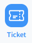

チケット一覧ページが表示されるので「チケット追加」を押下します

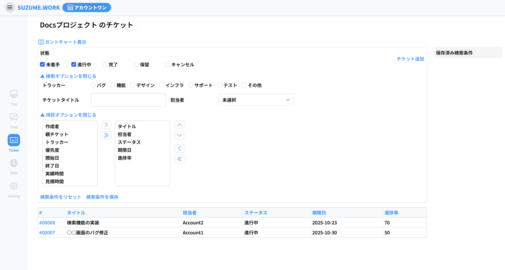

チケット作成ページに移動します

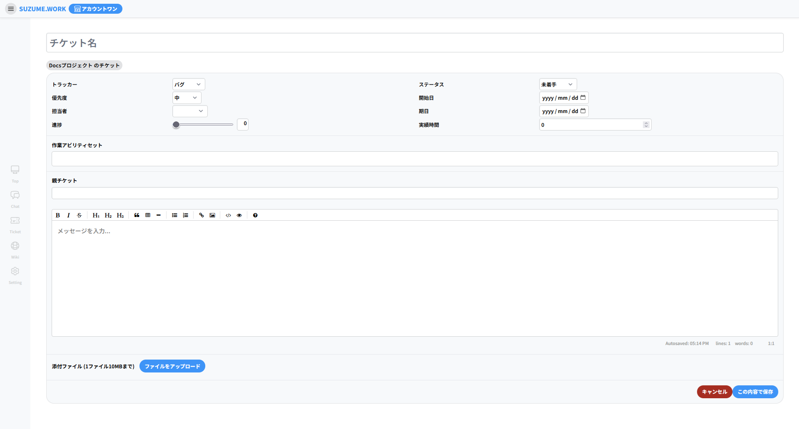

- **チケット名**
  - 入力必須
  - チケット一覧ページでの表示で利用します
- **トラッカー**
  - 変更は任意ですが、チケットの内容次第で変更推奨
  - チケットの検索機能で利用します
- **優先度**
  - 変更は任意です
- **担当者**
  - 変更は任意です
  - チケット一覧ページでの表示や検索機能で利用します
- **進捗**
  - 変更は任意です
  - チケット一覧ページでの表示で利用します
- **ステータス**
  - 変更は任意です
  - チケット一覧ページでの表示や絞り込み機能で利用します
- **開始日**
  - 変更は任意です
- **期日**
  - 変更は任意です
  - チケット一覧ページでの表示で利用します
- **実績時間**
  - 変更は任意です
- **作業アビリティセット**
  - 入力は任意です
- **親チケット・子チケット**
  - 入力は任意です
- **ファイルアップロード**
  - 入力は任意です

以下のように入力します

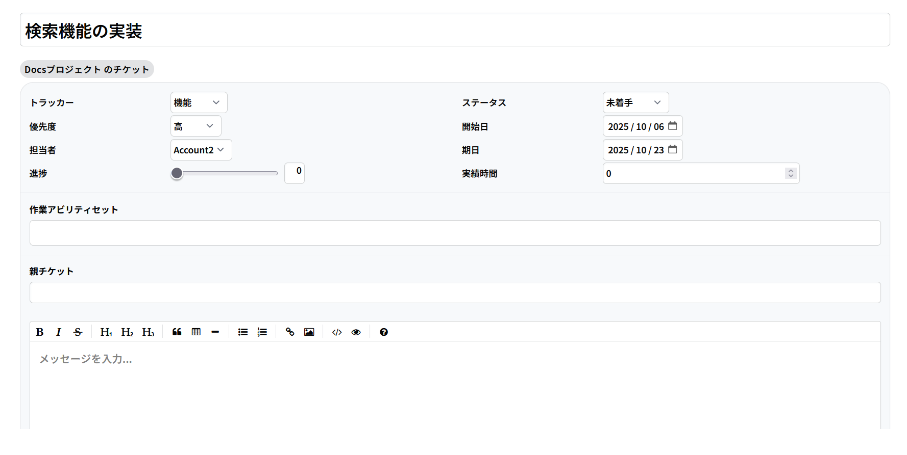

入力が完了したらチケット作成ページ下の「この内容で保存」を押下すると作成されます

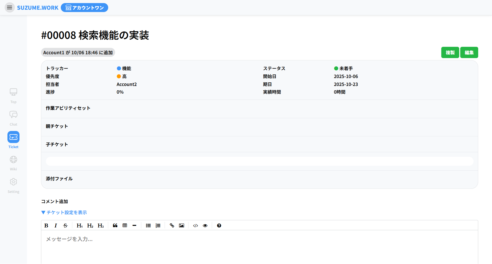

### チケットの編集

チケット一覧ページを開きます

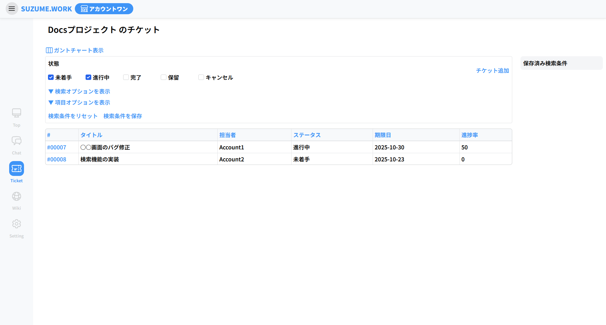
