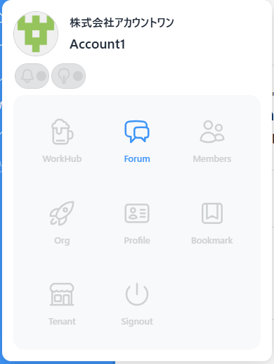
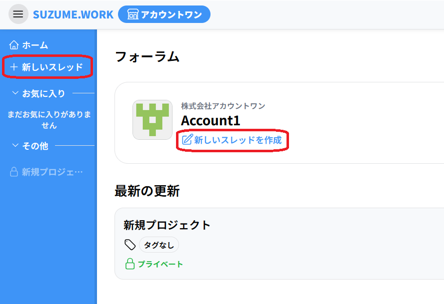
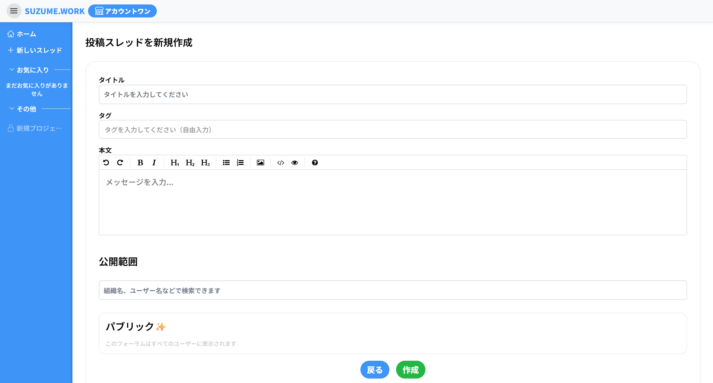
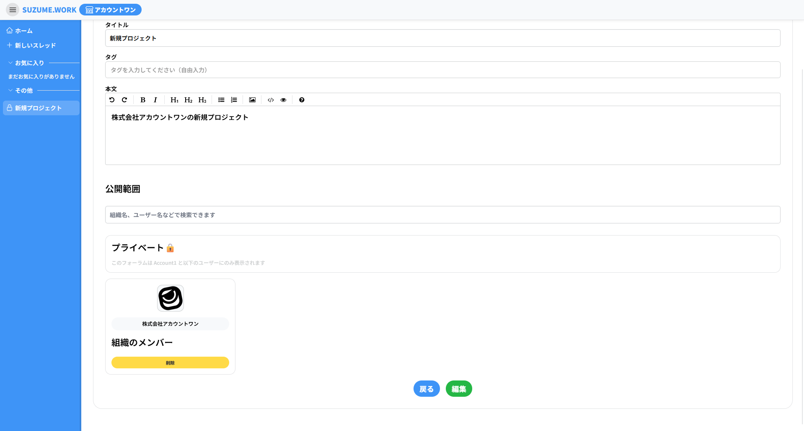
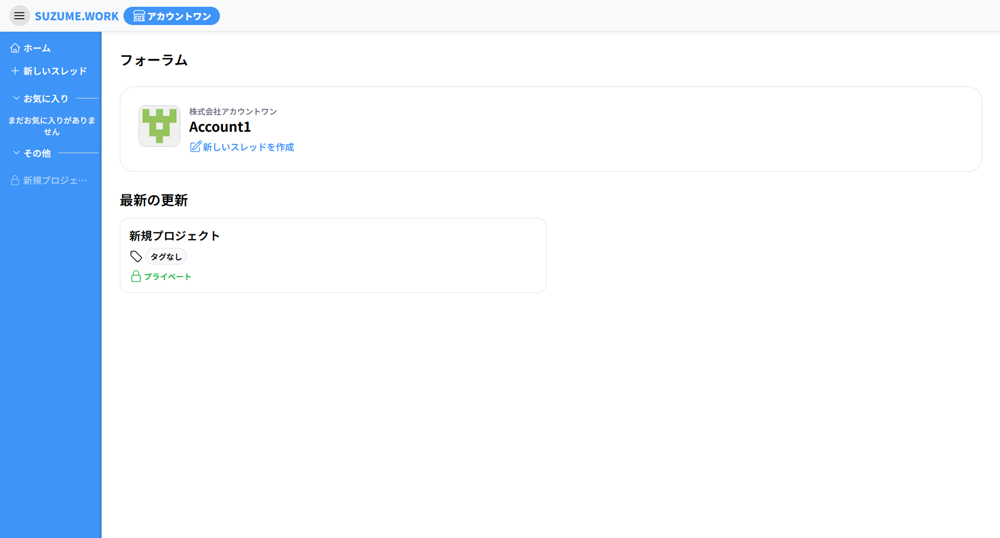
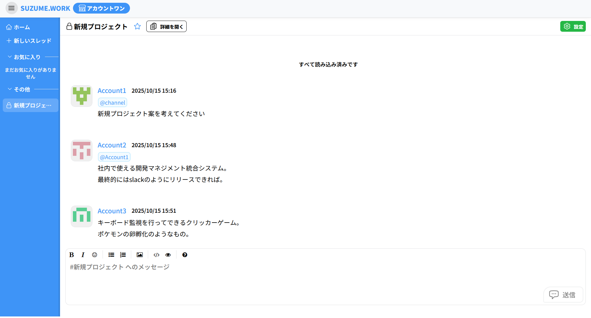

# Forum について

Forum は特定のテーマや話題毎にスレッドを作成し、メンバーと意見交換や情報共有を行えるチャットスペースです。

チケットのように担当や進捗を持つものではなく、議題やアイデア、相談など自由な話題を投稿できます。

スレッドは基本的にはテナント内のユーザーで共有されますが必要に応じて公開範囲を限定することもできます。

## スレッドの作成

メニューから「Forum」を選択します

サイドメニューの「新しいスレッド」を押下します

スレッドの新規作成ページに移動します

- **タイトル**
  - 入力必須
  - スレッドのタイトルとして保存されます
- **タグ**
  - 任意
- **本文**
  - 入力必須
  - スレッドの詳細説明になります
- **公開範囲**
  - 任意
  - 組織名またはユーザー名を入力することで閲覧できるユーザーを設定できます

以下のように入力します

入力が完了したらページ下の「作成」ボタンを押下すると、スレッド一覧ページにスレッドが作成されます

## スレッドの活用

フォーラムのスレッド機能は Workhub 内のチャットやチケットのコメントと同じ操作でメッセージを投稿できます。

Workhub のチャットやチケットのコメントは「リアルタイムな会話」に向いているのに対して、フォーラムは特定のテーマの意見や情報を蓄積できる場として機能します。

