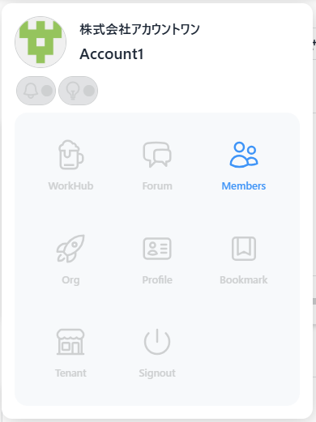

# Members について

メニューの Members から移動できます。

Members（メンバー管理）では、テナントに所属しているメンバーの一覧を確認できます。

それぞれのユーザーのアイコン、所属組織、登録されているスキル、稼働状況が一目で把握できます。

　　名前、所属組織で絞り込みができます

　　リスト表示、ブロック表示の切り替え

　　テナントメンバー招待（詳しくは「[メールアドレスを利用してテナントに招待する](page/01_tenant_02?id=メールアドレスを利用してテナントに招待する)」をご覧ください。）

　　テナント組織招待（詳しくは「[他の組織のすべてのユーザーを招待する](page/01_tenant_02?id=他の組織のすべてのユーザーを招待する)」をご覧ください。）

ユーザーを押下するとそれぞれのプロフィールを確認できます

プロフィール詳細のダイアログにある「編集」を押下するとプロフィールの編集が行えます。

詳しくは「プロフィールの編集」をご覧ください。
