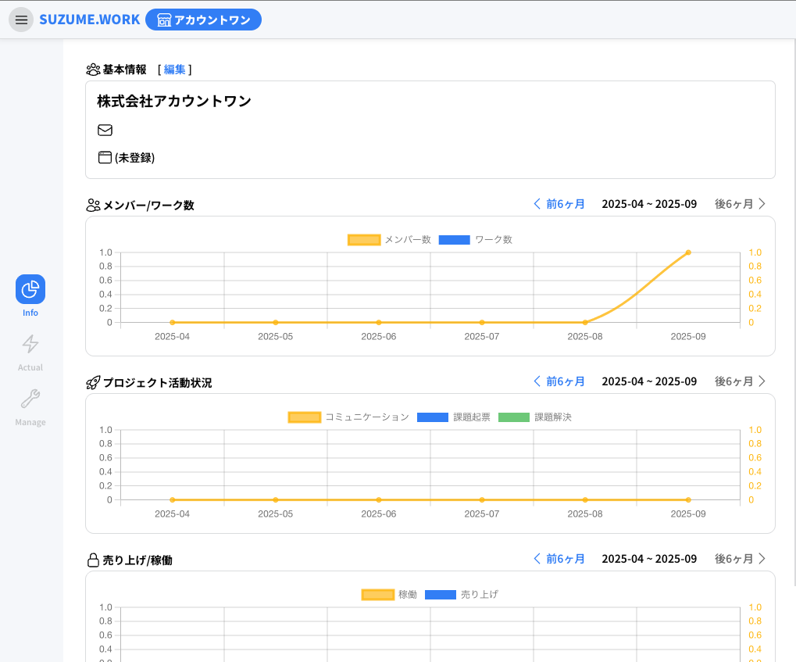
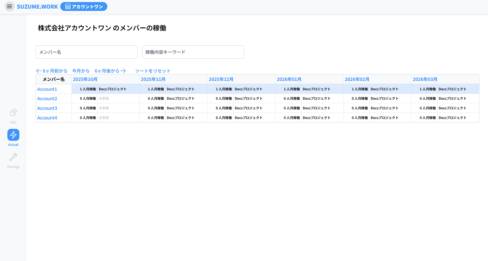

# Org について

メニューの Org から移動できます。

Org（組織管理）では、組織の情報を確認・管理ができます。

サイドメニューの「Info」は、組織単位での活動状況やメンバー数、プロジェクトの進捗などをグラフで確認できます。

基本情報の隣の「編集」は組織の管理署にのみ表示され、押下すると組織名やメールアドレスの編集ができます。

サイドメニューの「Actual」は、組織に所属しているメンバーの稼働状況を確認できます。

メンバー名、稼働内容を入力して特定のメンバーの絞り込みも可能です。

サイドメニューの「Manage」は、ユーザーを組織に招待や管理権限を持つユーザーなら組織のユーザーの権限変更や削除ができます。

詳しくは「[組織メンバーの招待](page/02_organization?id=_1-組織画面へ移動)」をご覧ください。
