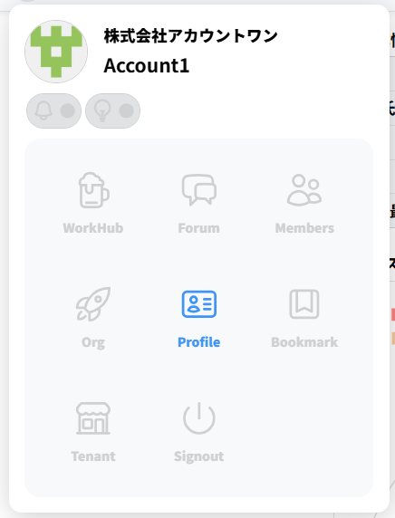
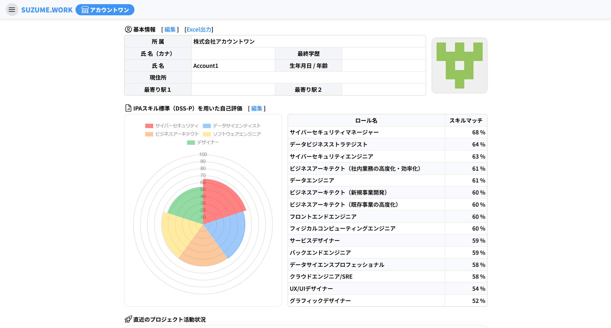
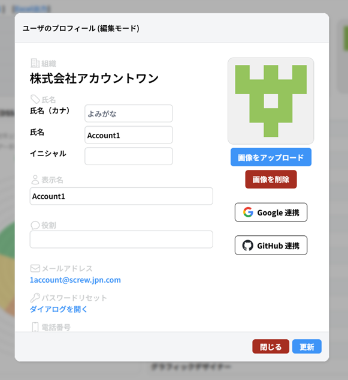
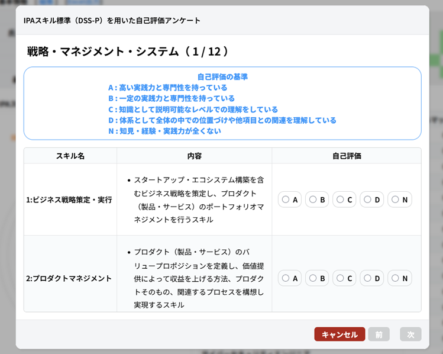
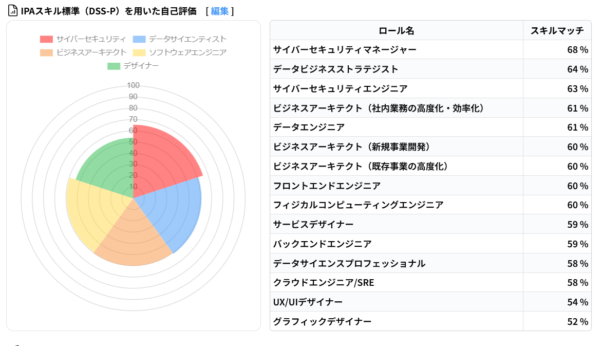
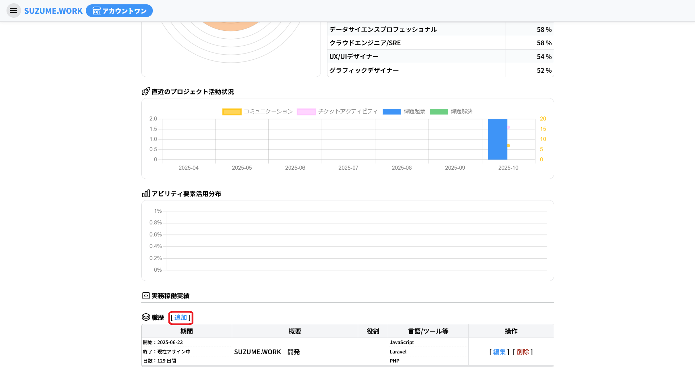
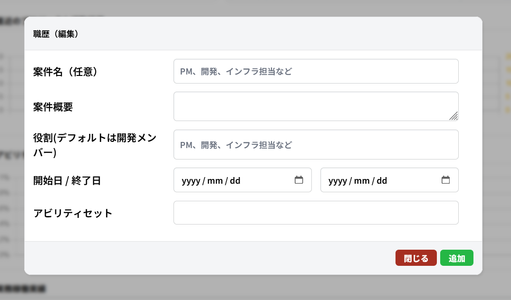

# Profile について

Profile では、ユーザー自身の基本情報・スキル・活動状況を管理できます。

登録された情報は、組織内での役割の把握やスキルの評価、キャリア管理などに活用されます。

登録データは Excel 出力を通して共有することもできます。

## ユーザーの基本情報の編集

メニューの「Profile」からユーザーのプロフィールページに移動します

ページ上の基本情報の右側の「編集」を押下すると編集ができます

編集時はダイアログが表示され情報を入力できます。

- **氏名**
  - 氏名のみ入力必須

**任意項目**

- **読み仮名**
  - 片仮名で入力してください
- **イニシャル**
  - イニシャルは**〇.〇**（例：T.S）の形式で大文字のアルファベットで入力してください
- **表示名**
  - 他のユーザーに表示される名前になります
- **電話番号**
  - 数字のみ、またはハイフンを含む形式で入力してください
- **郵便番号**
  - 数字のみ、またはハイフンを含む形式で入力してください
- **役割**
- **最終学歴**
- **誕生日**
- **性別**
- **住所**
- **最寄り駅**

プロフィールの編集はこのページの他、メニューのユーザーアイコンを押下しても行えます

## IPA スキル標準を用いた自己評価

ページ上の IPA スキル標準（DSS-P）を用いた自己評価の右側の「編集」を押下することで自己評価ができるアンケートが表示されます

入力後、アンケートの結果に応じてユーザーにあったスキルが表示されます

## 職歴の追加

ページ下の職歴の隣の「追加」を押下すると職歴を追加できます

ダイアログが表示されるので、追加したい情報を入力してください

- **案件名**
  - 任意項目
- **案件概要**
  - 必須項目
- **役割**
  - 任意項目
- **開始日・終了日**
  - 開始日は必須項目
  - 終了日は任意項目
- **アビリティセット**
  - 任意項目
  - 使用する言語の入力
